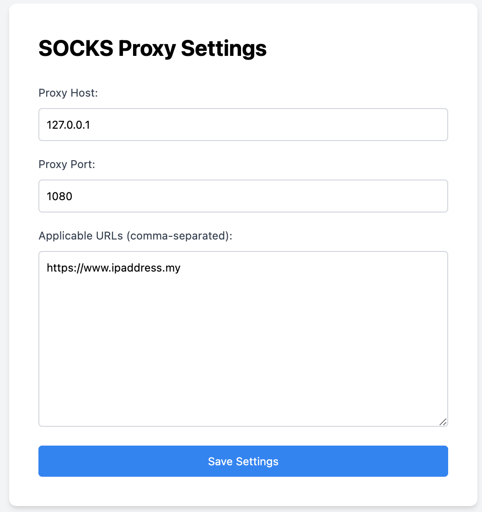
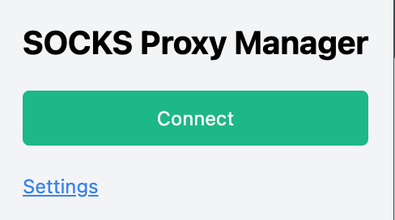

# Chrome SOCKS Proxy Extension

This Chrome extension allows you to configure and use a SOCKS proxy for your browsing sessions.

## Features

- Easy configuration of SOCKS proxy settings
- Enable/disable proxy with a single click
- Supports SOCKS4 and SOCKS5 proxies

## Screenshots

Here are some screenshots of the Chrome SOCKS Proxy Extension in action:

### Proxy Configuration


### Proxy Enabled


## Installation

1. Clone the repository:
  ```bash
  git clone https://github.com/yourusername/chrome_socks_proxy_extension.git
  ```
2. Open Chrome and navigate to `chrome://extensions/`.
3. Enable "Developer mode" by toggling the switch in the top right corner.
4. Click on "Load unpacked" and select the cloned repository folder.

## Usage

1. Click on the extension icon in the Chrome toolbar.
2. Enter the proxy details (host, port, and type).
3. Click "Save" to apply the settings.
4. Toggle the proxy on or off using the extension icon.

## Contributing

Contributions are welcome! Please open an issue or submit a pull request.

## License

This project is licensed under the MIT License. See the [LICENSE](LICENSE) file for details.

## Contact

For any questions or suggestions, please contact [yourname@example.com](mailto:yourname@example.com).
